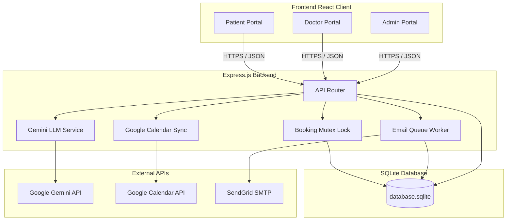

# Healthcare Appointment & Follow-up Manager

An enterprise-ready, fullstack medical booking, clinical summarization, and patient compliance platform. This system provides role-based portals for **Patients**, **Doctors**, and **Clinic Administrators** to schedule visits, synchronize event invitations with Google Calendar, run automated medication reminders, and translate complex clinical notes using LLMs with robust offline fallback processing.

---

## 1. System Architecture

The platform uses a decoupled client-server architecture powered by a React client and an Express backend, backed by an ACID-compliant SQLite transaction layer.



---

## 2. Requirements Mapping (Compliance Matrix)

This matrix outlines how each requirement specified by the organization is satisfied within this codebase:

| Company Requirement | Implementation Status | Technical Component / File Link |
| :--- | :---: | :--- |
| **Role-Based Portals** | **Implemented** | Managed via JWT verification in [authMiddleware.js](file:///d:/HealthCare%20Appointment/backend/authMiddleware.js) and role-specific client screens in [App.jsx](file:///d:/HealthCare%20Appointment/frontend/src/App.jsx). |
| **Admin Doctor Profile Control** | **Implemented** | Admin endpoints are managed in [admin.js](file:///d:/HealthCare%20Appointment/backend/routes/admin.js) and rendered in [AdminPortal.jsx](file:///d:/HealthCare%20Appointment/frontend/src/portals/AdminPortal.jsx). |
| **Specialization Search & Slot Booking** | **Implemented** | Implemented search filtering by specialization and interactive slot booking in [PatientPortal.jsx](file:///d:/HealthCare%20Appointment/frontend/src/portals/PatientPortal.jsx) and the patient route [patient.js](file:///d:/HealthCare%20Appointment/backend/routes/patient.js). |
| **Double-Booking & Mutex Checks** | **Implemented** | Database writes are serialized and locked transactionally in [bookingLock.js](file:///d:/HealthCare%20Appointment/backend/bookingLock.js) to guarantee absolute concurrency protection. |
| **Doctor Leave Cancellations** | **Implemented** | Handled in the leave router endpoint in [admin.js](file:///d:/HealthCare%20Appointment/backend/routes/admin.js#L126-L194). It cancels conflict bookings, deletes Google Calendar events, and sends email notifications. |
| **AI Pre-Visit Symptom Analysis** | **Implemented** | Symptoms are sent to Gemini in [llmService.js](file:///d:/HealthCare%20Appointment/backend/llmService.js#L520-L589) to extract **Urgency Level**, **Chief Complaint**, and **Suggested Doctor Questions**. |
| **AI Post-Visit Summary** | **Implemented** | Triggers Gemini analysis in [llmService.js](file:///d:/HealthCare%20Appointment/backend/llmService.js#L591-L682) to format a patient-friendly summary and split out individual medications. |
| **Medication Reminders Engine** | **Implemented** | Reminders are stored in `medication_reminders` and sent automatically by the background worker in [worker.js](file:///d:/HealthCare%20Appointment/backend/worker.js). We also formatted frequency strings (`twice_daily` $\to$ `twice daily`) for premium readability. |
| **Email Notification System** | **Implemented** | Confirmations, cancellations, and reminders are queued and processed via [emailService.js](file:///d:/HealthCare%20Appointment/backend/emailService.js) with support for both live SendGrid transmission and local `sent_emails.log` auditing. |
| **Google Calendar Integration** | **Implemented** | OAuth 2.0 calendar invites are created, synced, and deleted dynamically using [calendarService.js](file:///d:/HealthCare%20Appointment/backend/calendarService.js). |
| **Graceful LLM Failure Handling** | **Implemented** | Wrap all Gemini calls in strict validations in [llmService.js](file:///d:/HealthCare%20Appointment/backend/llmService.js). On API failures/rate limits, the server falls back to rule-based parsing and populates `patient_summary` with the exact requested user-facing fallback message. |

---

## 3. Database Schema

The database utilizes SQLite. It contains the following core tables:

### `users`
Tracks registered users, passwords, and portal roles.
* `id` (TEXT, PRIMARY KEY): Unique identifier.
* `email` (TEXT, UNIQUE, NOT NULL): User email address.
* `password_hash` (TEXT, NOT NULL): Bcrypt encrypted password.
* `role` (TEXT, NOT NULL): One of `patient`, `doctor`, or `admin`.
* `full_name` (TEXT, NOT NULL): Full name of the user.
* `created_at` (DATETIME, DEFAULT CURRENT_TIMESTAMP)

### `doctor_profiles`
Maintains doctor working parameters, schedules, and leave calendars.
* `user_id` (TEXT, PRIMARY KEY, REFERENCES `users(id)`): Link to users table.
* `specialization` (TEXT, NOT NULL): Medical specialization (e.g. Cardiology).
* `working_hours` (TEXT, NOT NULL): JSON object containing daily active ranges (e.g., `{"Monday":{"start":"09:00","end":"17:00"}}`).
* `slot_duration` (INTEGER, DEFAULT 30): Duration of each appointment slot in minutes.
* `leave_days` (TEXT, DEFAULT '[]'): JSON array of leave dates string format `YYYY-MM-DD`.

### `appointments`
Manages schedules, urgency ratings, and post-visit records.
* `id` (TEXT, PRIMARY KEY): Unique identifier.
* `patient_id` (TEXT, NOT NULL, REFERENCES `users(id)`)
* `doctor_id` (TEXT, NOT NULL, REFERENCES `users(id)`)
* `appointment_date` (TEXT, NOT NULL): `YYYY-MM-DD`
* `start_time` (TEXT, NOT NULL): `HH:MM` (24hr format)
* `end_time` (TEXT, NOT NULL): `HH:MM` (24hr format)
* `status` (TEXT, DEFAULT 'booked'): One of `booked`, `completed`, or `cancelled`.
* `symptoms` (TEXT): Symptoms text provided by the patient.
* `urgency_level` (TEXT): Urgency classification (`Low`, `Medium`, `High`).
* `chief_complaint` (TEXT): One-sentence clinical complaint parsed by LLM.
* `suggested_questions` (TEXT): JSON array of suggested checkup questions.
* `clinical_notes` (TEXT): Observations submitted by the doctor.
* `prescription` (TEXT): Medication script entries.
* `patient_summary` (TEXT): Patient-friendly translation of clinical notes.
* `google_event_id` (TEXT): Linked Google Calendar event ID.
* `created_at` (DATETIME)
* `updated_at` (DATETIME)

### `medication_reminders`
Stores scheduled medication intervals.
* `id` (TEXT, PRIMARY KEY)
* `appointment_id` (TEXT, REFERENCES `appointments(id)`)
* `patient_id` (TEXT, REFERENCES `users(id)`)
* `medication_name` (TEXT, NOT NULL)
* `dosage` (TEXT, NOT NULL)
* `frequency` (TEXT, NOT NULL): e.g. `daily`, `twice_daily`, `weekly`.
* `start_date` (TEXT, NOT NULL): `YYYY-MM-DD`
* `end_date` (TEXT, NOT NULL): `YYYY-MM-DD`

### `email_queue`
Facilitates outbox scheduling and retrying.
* `id` (TEXT, PRIMARY KEY)
* `recipient_email` (TEXT, NOT NULL)
* `subject` (TEXT, NOT NULL)
* `body` (TEXT, NOT NULL)
* `status` (TEXT, DEFAULT 'pending'): One of `pending`, `sent`, or `failed`.
* `retry_count` (INTEGER, DEFAULT 0)
* `last_error` (TEXT)
* `created_at` (DATETIME, DEFAULT CURRENT_TIMESTAMP)

---

## 4. API Endpoints Documentation

### Authentication Routes (`/api/auth`)
* `POST /register`: Registers a new user account.
  * *Body*: `{ "email", "password", "role", "fullName" }`
* `POST /login`: Log in and retrieve JWT token.
  * *Body*: `{ "email", "password" }`
  * *Response*: `{ "token", "user": { "id", "email", "role", "fullName" } }`
* `GET /google`: Initiates Google OAuth consent screen workflow.
* `GET /google/callback`: OAuth callback code capture and token exchange.

### Admin Dashboard Routes (`/api/admin`)
* `GET /doctors`: Lists all doctors and profiles.
* `POST /doctors`: Register a new doctor.
  * *Body*: `{ "email", "password", "fullName", "specialization", "workingHours", "slotDuration" }`
* `PUT /doctors/:id`: Update existing doctor configurations.
* `POST /doctors/:id/leave`: Registers a leave date (`YYYY-MM-DD`) for a doctor.
  * *Body*: `{ "date" }`
  * *Flow*: Updates doctor leave list, cancels conflicting booked appointments on that date, syncs calendar deletions, and queues cancellation notification emails.

### Patient Dashboard Routes (`/api/patient`)
* `GET /doctors`: List doctors with search filtering by specialization.
* `GET /doctors/:id/slots?date=YYYY-MM-DD`: Fetches 30-minute free intervals.
* `POST /appointments`: Book a consultation slot.
  * *Body*: `{ "doctorId", "date", "startTime", "symptoms" }`
  * *Flow*: Runs double-booking safety check, executes LLM symptom analysis, queues confirmation emails, and syncs Google Calendar event.
* `GET /appointments`: Retrieve the patient's upcoming and completed consultation list.

### Doctor Dashboard Routes (`/api/doctor`)
* `GET /appointments`: Get all consultations scheduled under this doctor.
* `POST /appointments/:id/complete`: Submits notes and generates prescription records.
  * *Body*: `{ "clinicalNotes", "prescription" }`
  * *Flow*: Triggers post-visit LLM notes formatting, schedules medication reminders, and queues summary email alerts.

---

## 5. LLM Prompts and Flow

The platform uses Google Gemini to translate raw patient inputs and doctor notes into structured clinical formats.

### A. Pre-Visit Symptom Analysis Prompt
Triggered on booking to help the doctor understand the incoming case context.
```text
You are a clinical assistant. Analyze the patient's symptoms: "${symptoms}".
Return a JSON object containing:
1. "urgency_level": Must be exactly "Low", "Medium", or "High" based on symptom severity.
2. "chief_complaint": A concise 1-sentence summary (max 15 words) of the main issue. It MUST be symptom-specific and patient-specific, not a generic category name.
3. "suggested_questions": An array of exactly 3 relevant diagnostic questions tailored specifically to these symptoms that the doctor should ask the patient.
```

### B. Post-Visit Clinical Summary Prompt
Triggered on visit completion to structure clinical text and extract prescription reminders.
```text
You are a clinical AI assistant. Convert these clinical notes and prescriptions into a patient-friendly summary:
"${notes}"

Return a JSON object containing:
1. "patient_summary": A clear, patient-friendly explanation covering:
   - Diagnosis: Explain the condition simply.
   - Medication Schedule: Briefly state how and when to take medications.
   - Lifestyle Advice: Actionable wellness/recovery tips (e.g., rest, hydration, things to avoid).
   - Follow-up Instructions: When to consult a doctor again or seek urgent care.
2. "medications": An array of prescription objects. Each object MUST contain:
   - "name": Medication name.
   - "dosage": (e.g., 500mg, 10ml, 1 tablet).
   - "frequency": Must be exactly "daily", "twice_daily", or "weekly".
   - "start_date": formatted YYYY-MM-DD (default to today if unspecified).
   - "end_date": formatted YYYY-MM-DD (calculated based on the duration, defaulting to 7 days from today if unspecified).
```

### C. Graceful Fallback System
If the Gemini API key is missing or calls fail (e.g., 429 Quota limits/Network outages):
* **Console Logging**: The detailed error is logged for developer diagnostics.
* **Prescription Reminders Extraction**: The system falls back to a rule-based regex script to parse medication lines, dosages, and schedules normally so that no patient reminders are lost.
* **UI Display**: The `patient_summary` field is cleanly updated with this exact fallback message to prevent UI crashes:
  > **AI Consultation Summary Unavailable**
  >
  > The AI consultation summary could not be generated at this time due to a temporary AI service issue.
  >
  > The patient's consultation details have been saved successfully.
  >
  > No data has been lost.
  >
  > Please try generating the summary again later.

---

## 6. Google Calendar Developer Setup

To authorize your clinic dashboard with Google Calendar, complete the following steps in the Google Cloud Console:

1. **Create a Google Cloud Project**
   * Go to the [Google Cloud Console](https://console.cloud.google.com/).
   * Click **New Project** and name it (e.g., `Clinic-Scheduler`).

2. **Enable Google Calendar API**
   * Go to **API & Services > Library**.
   * Search for **Google Calendar API** and click **Enable**.

3. **Configure OAuth Consent Screen**
   * Go to **API & Services > OAuth Consent Screen**.
   * Choose **External** user type.
   * Add required developer contact information.
   * **Scopes**: Add the scopes:
     * `https://www.googleapis.com/auth/calendar.events`
     * `https://www.googleapis.com/auth/calendar`
   * **Test Users**: Add the email accounts of the doctors/patients you want to test with (required while the app status is set to *Testing*).

4. **Create OAuth 2.0 Credentials**
   * Go to **API & Services > Credentials**.
   * Click **Create Credentials** and select **OAuth Client ID**.
   * Choose Application Type: **Web Application**.
   * **Authorized Redirect URIs**:
     Add your callback URL (e.g. `http://localhost:5000/api/auth/google/callback`).
   * Click **Create** to obtain your `Client ID` and `Client Secret`.
   * Add these keys directly to your backend `.env` file.

---

## 7. Setup & Installation

### System Requirements
* Node.js (v16.x or higher)
* npm (v8.x or higher)
* SQLite3

### Step-by-Step Installation

1. **Install Dependencies**
   Navigate to the root directory and install both frontend and backend dependencies using:
   ```bash
   npm install
   ```
   *(Note: The root-level package installs and matches dependencies recursively in the `backend/` and `frontend/` folders).*

2. **Configure Environment Variables**
   Create a copy of `.env.example` in the `backend/` folder and name it `.env`:
   ```bash
   cp backend/.env.example backend/.env
   ```
   Modify the `.env` settings with your API keys.

3. **Start the Platform**
   * **Backend server (Port 5000)**:
     ```bash
     npm run start:backend
     ```
   * **Frontend server (Vite - Port 5173)**:
     ```bash
     npm run start:frontend
     ```
   Open your browser to `http://localhost:5173`.

4. **Run Verification & Integration Tests**
   A suite of automated tests verifying the concurrency locks and LLM fallback engines is included. Run it with:
   ```bash
   npm test
   ```

---

## 8. Seeded Demo Accounts

The database is pre-seeded with these credentials for testing:

| Role | Email | Password | Details |
| :--- | :--- | :--- | :--- |
| **Administrator** | `admin@clinic.com` | `admin123` | Control calendars & declare leaves |
| **Doctor** | `doctor@clinic.com` | `doctor123` | Dr. Gregory House (Diagnostics) |
| **Patient** | `patient@clinic.com` | `patient123` | John Doe |
